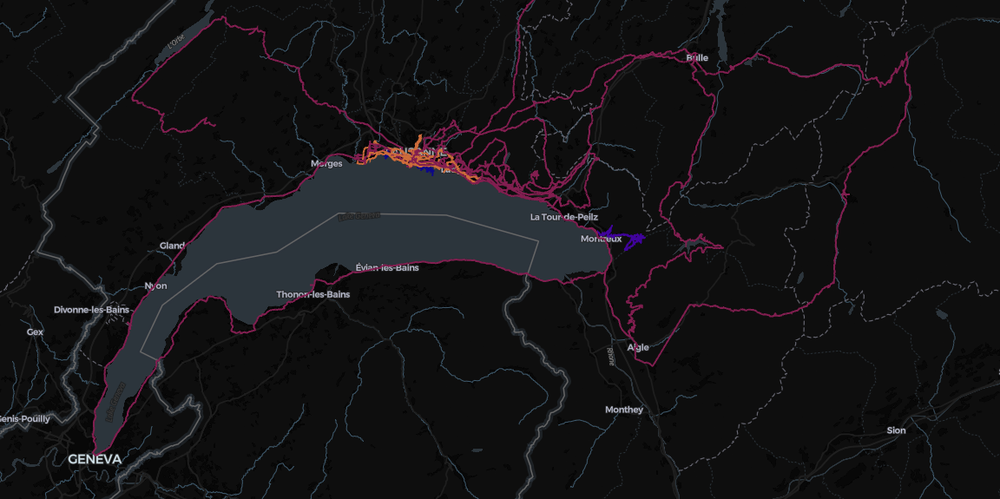

# Display at all your recorded Strava activities on an interactive map
EU data law is amazing, because it gives you a right to access private information stored by third parties. Today, let's have a look at the data Strava stores about you.

## How to use?
Actually, it#s pretty simple. It just takes a little patience. Follow these steps:

1. Go to [strava.com](https://www.strava.com/) -> Log in -> Settings -> My Account -> Download or Delete my Account -> Request your archive
2. Wait a couple of days
3. Download your data once available
4. Unpack it and place everything in the `data` directory of this repository
5. Setup a Python environment and install dependencies
6. Run the main script (`python main.py`)
7. A `map.html` file should be generated that shows your activities over time.

## Caveats
As my data is in German, so are the activities names that are used to map different activities to different colors.
If you use Strava in another language, just edit the corresponding fields in the `data.color` dictionary in `utils.py`.

If you have your account for a couple years, there#s a lot of data to process.
The script should run just fine on your average laptop, but it might take a couple minutes.
Once the html file is generated, you should be able to browse it without any idle time.

The current default location is Munich.
If you don#t want the initial map to be centered around it, just change the corresponding coordinates in `main.py`.
